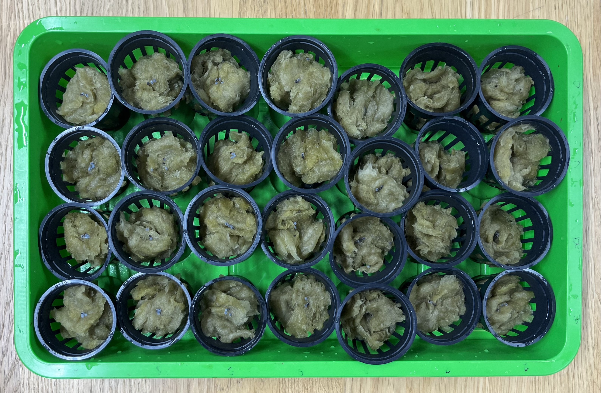

# How to grow seeds?

# Material

- Seedling pots
- Clay balls
- Rockwool
- Basilic seeds or seeds listed in **[Plants to Implement](https://www.notion.so/Plants-to-implement-db5b296962184f5ea9d98efac91d8127?pvs=21)**
- Growing box with lights
- Water

# **Step 1: Hygiene Measures**

1. Thoroughly wash all utensils that you will be using, as well as those that will come into contact with the microgreens, seeds, or substrate. You can use soap, vinegar, or another disinfectant.
2. Wash and disinfect your hands thoroughly before handling the seeds, microgreens, and substrate. Alternatively, you can wear gloves.

# **Step 2: Prepare the Soil**

1. Divide the rockwool into small balls approximately the size of a ping pong ball.
2. Moisten the rockwool with some water. Make sure it is moist but not soaked.
3. Place each piece of rockwool in a seedling pot.

    

# **Step 3: Sow the Microgreens**

1. Using a small clamp or tweezers, place one seed in each pot.
2. Put the seedling pots in the growing box and position it in a warm place (D).
    
    Place seedling pots in the growing syst
    

# **Step 4: Growing Phase**

1. Allow the microgreens to grow for 3 days.
2. After 3 days, turn on the lights. (D+3)
3. After a week under the lights  (D+10), the sprouts have grown.

pouet pouet

<figure>
    
    <figcaption>Sprouts after 10 days</figcaption>
</figure>

denis

    
    Sprouts after 10 days 
    
5. Add clay balls to each seedling pots where the sprouts have grown.
    
    

    
    Add a few clay balls in the seedling pots before placing the plants in the system
    
7. Transfer the sprouts to the system. Only transfer the ones that have grown to a length of more than 1 cm. This should be done on Day 10 (D+10).
8. Follow the instructions on  to commission the system. 
    
    [SPH : System’s Management](https://www.notion.so/SPH-System-s-Management-ec08e70ad106498aba008d94ecaa699e?pvs=21)
